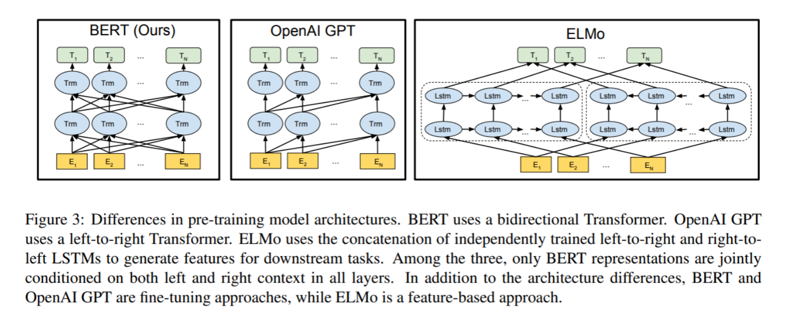
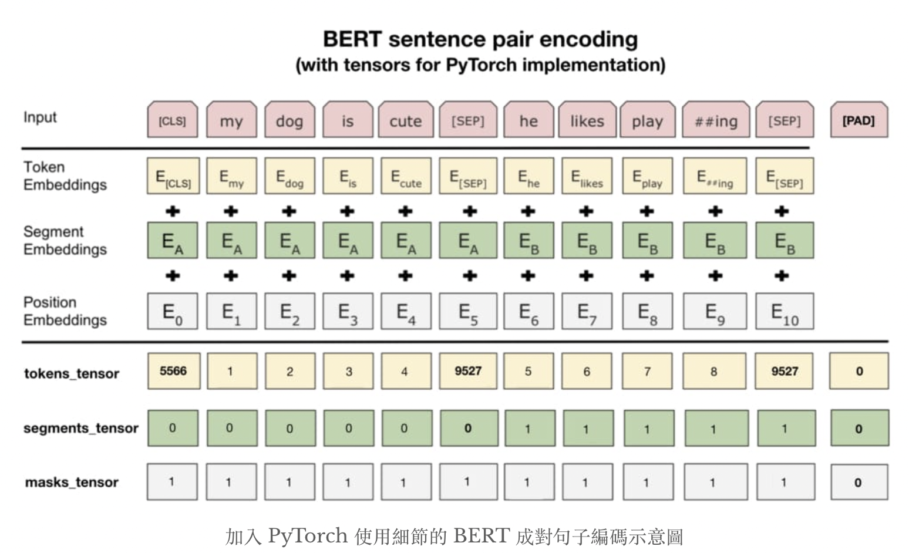
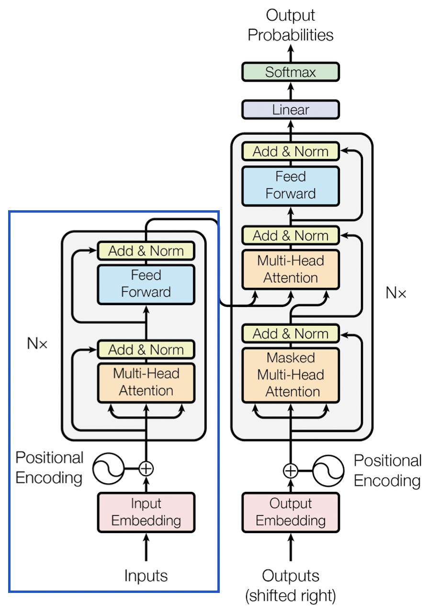
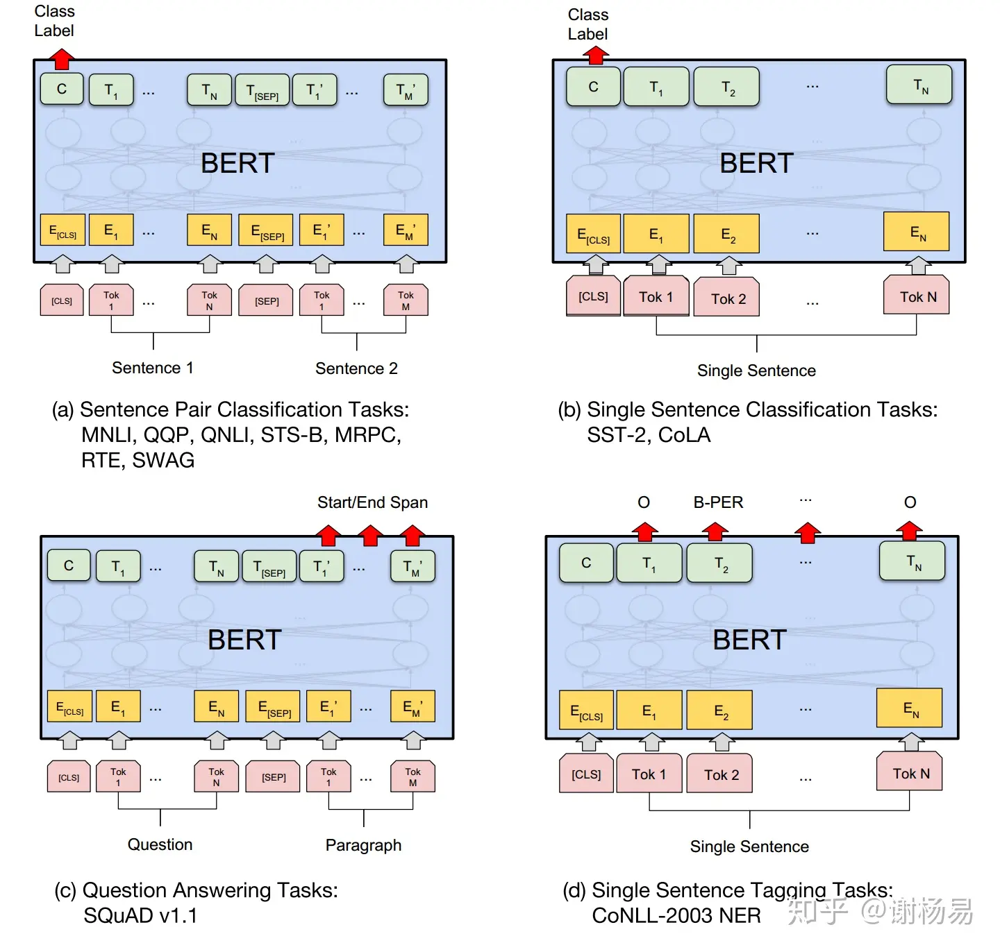

## 语言模型的构建

### 自回归模型

本质上是单向的，它只沿着一个方向阅读句子

- 正向 从左到右预测
- 反向 从右到左预测

### 自编码模型

关于传统的语言模型训练, 都是采用left-to-right, 或者left-to-right + right-to-left结合的方式, 但这种单向方式或者拼接的方式提取特征的能力有限. 为此BERT提出一个深度双向表达模型(deep bidirectional representation). 即同时利用正向预测和反向预测的优势，从两个方向阅读句子即从左到右和从右到左，双向模型能给出更好的结果，因为从两个方向阅读句子，模型能更加清晰的理解句子

# BERT概念

BERT  （Bidirectional Encoder Repreasentations from Transformers），多transformer的双向编码器表示方法

## 什么是双向编码

双向编码是指模型在处理文本时能够同时考虑**左侧（上文）和右侧（下文）**的信息。这与传统的单向语言模型（如GPT）形成对比，**单向模型只能根据上文预测下文，无法利用下文信息**。

## 与Transformer的区别

| 方面           | Transformer                                     | BERT                                 |
| :------------- | ----------------------------------------------- | ------------------------------------ |
| **架构**       | 编码器-解码器结构                               | 仅编码器结构                         |
| **注意力机制** | 编码器：双向注意力 解码器：掩码自注意力（单向） | 完全双向自注意力                     |
| **训练任务**   | 机器翻译等序列到序列任务                        | MLM + NSP（掩码语言模型+下一句预测） |
| **方向性**     | 编码器双向，解码器单向                          | 完全双向                             |
| **应用**       | 序列生成、翻译                                  | 语言理解、分类、问答                 |

## bert的双向性

BERT的双向性通过  **掩码语言模型（Masked Language Model, MLM）**任务实现。

##### 训练过程：

- 随机掩盖输入序列中的部分token（15%）[MASK]
- 模型需要基于**所有非掩盖位置**的信息来预测被掩盖的token
- 每个位置的预测都可以利用整个序列的上下文信息

##### 微调过程：

> 80%掩实际词  10% 使用随机词替换  10% 概率不做任何改变

# 预训练

针对维基百科数据进行`自监督学习`并导出的模型参数，对于一个新任务不再用随机权重来初始化模型，而是基于训练过的模型权重来初始化模型，根据新任务调整其权重，这是`迁移学习`

bert包含2个训练任务：

## MLM

采用MASK任务来训练模型.

1. 在原始训练文本中, 随机的抽取15%的token作为参与MASK任务的对象.
2. 在这些被选中的token中, 数据生成器并不是把它们全部变成[MASK], 而是有下列3种情况.

   - 在80%的概率下, 用[MASK]标记替换该token, 比如my dog is hairy -> my dog is [MASK]
   - 在10%的概率下, 用一个随机的单词替换token, 比如my dog is hairy -> my dog is apple
   - 在10%的概率下, 保持该token不变, 比如my dog is hairy -> my dog is hairy

3. 模型在训练的过程中, 并不知道它将要预测哪些单词? 哪些单词是原始的样子? 哪些单词被遮掩成了[MASK]? 哪些单词被替换成了其他单词? 正是在这样一种高度不确定的情况下, 反倒逼着模型快速学习该token的分布式上下文的语义, 尽最大努力学习原始语言说话的样子. 同时因为原始文本中只有15%的token参与了MASK操作, 并不会破坏原语言的表达能力和语言规则.

## NSP

在NLP中有一类重要的问题比如QA(Quention-Answer), NLI(Natural Language Inference), 需要模型能够很好的理解两个句子之间的关系, 从而需要在模型的训练中引入对应的任务. 在BERT中引入的就是Next Sentence Prediction任务. 采用的方式是输入句子对(A, B), 模型来预测句子B是不是句子A的真实的下一句话.

1. 所有参与任务训练的语句都被选中作为句子A.

   - 其中50%的B是原始文本中真实跟随A的下一句话. (标记为IsNext, 代表正样本)
   - 其中50%的B是原始文本中随机抽取的一句话. (标记为NotNext, 代表负样本)

2. 在NSP任务中, BERT模型可以在测试集上取得97%-98%的准确率.

# 结构

- 最底层黄色标记的Embedding模块
- 中间层蓝色标记的Transformer模块
- 最上层绿色标记的预微调模块

## Embedding模块

tokenization 处理，且两个特殊的 Token 会插入在文本开头 [CLS] 和结尾 [SEP]。[CLS]表示该特征用于分类模型，对非分类模型，该符号可以省去。[SEP]表示分句符号，用于断开输入语料中的两个句子。

- `Token Embeddings`：将词表中的每个 token 转化为高维向量作为输入，首个单词 CLS 用于分类任务

  - 通过建立词表将每个token转换成一个高维向量，作为模型输入。特别的，英文词汇会做更细粒度的切分。将词切割成更细粒度的 Word Piece 是为了解决未登录词的常见方法。

- `Segment Embeddings`：用于区分句子界限，分别以 0 和 1 标记不同句子
- `Position Embeddings`：用于记录文本中各 token 的相对顺序

  - BERT 中处理的最长序列是 512 个 Token，长度超过 512 会被截取，BERT 在各个位置上学习一个向量来表示序列顺序的信息编码进来，这意味着 Position Embeddings 实际上是一个 (512, 768) 的 lookup 表。

最后，BERT 模型将 Token Embeddings (1, n, 768) + Segment Embeddings(1, n, 768) + Position Embeddings(1, n, 768) 求和的方式得到一个 Embedding(1, n, 768) 作为模型的输入。

## Encoder

BERT是用了Transformer的encoder侧的网络，BERT的维度是768维度，然后分成12个head，每个head的维度是64维。BERT模型分为24层和12层两种，其差别就是使用transformer encoder的层数的差异。

- BERT-base : L=12，H=768，A=12，参数总量110M；
- BERT-large: L=24，H=1024，A=16，参数总量340M；

## prediction层

prediction层则采用线性全连接并softmax归一化，下游任务基本上对prediction做改造即可。在不同的下游任务使用中，可以把bert理解为一个特征抽取encoder，根据下游任务灵活使用。下面分别是BERT应用的四个场景

1. 语句对分类，如语句相似度任务，语句蕴含判断等
2. 单语句分类，如情感分类
3. QA任务，如阅读理解，将question和document构建为语句对，输出start和end的位置即可 <li>序列标注，如NER，从每个位置得到类别即可。

**[CLS]的作用**

BERT在第一句前会加一个[CLS]标志，最后一层该位对应向量可以作为整句话的语义表示，从而用于下游的分类任务等。因为与文本中已有的其它词相比，这个无明显语义信息的符号会更“公平”地融合文本中各个词的语义信息，从而更好的表示整句话的语义

# 