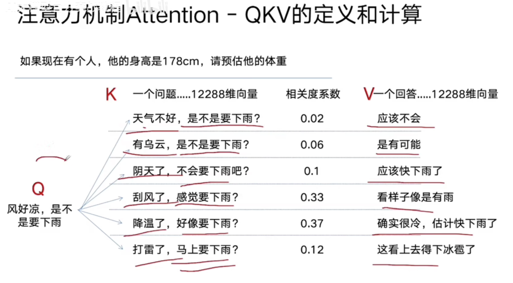

可以并行计算，输入token 是n 计算复杂度为 $n^2$

# 公式

$Attention(Q,K,V)=softmax(\frac{QK^T}{\sqrt{d_k}})\cdot V$

- $d_k$

  维度  512 768 12288

- Q

  query

- K

  每个属性向量

  $Q \cdot   K^T$计算Q和k的相关度

- V: 值

# 自注意力机制 self-attention

如果QKV变成自己本身，就是自注意机制

目的：信息聚合

输入：输入长度*d_model

输出：输入长度*d_model

> 问题：没有神经网络，就没有可训练参数

输入都是embedding，但是qkv计算不包含参数

输出向量z，神经网络完成某种线性变化，突出一些需要突出的，弱化需要弱化部分

因此更加三个神经网络，$W_q$$W_k$$W_v$， 每个不同层使用不同的 $W_q$$W_k$$W_v$

# 多头自注意力机制

96头表示96个角度分析问题

d_model 12288,  提取出特征 128    [12288,128]

基于一个中心主题词，查看其他词的注意力，最后拼接起来   [96,128]   96*12288  拼接之后   经过一层神经网络  $W_o$

��过一层神经网络  $W_o$

