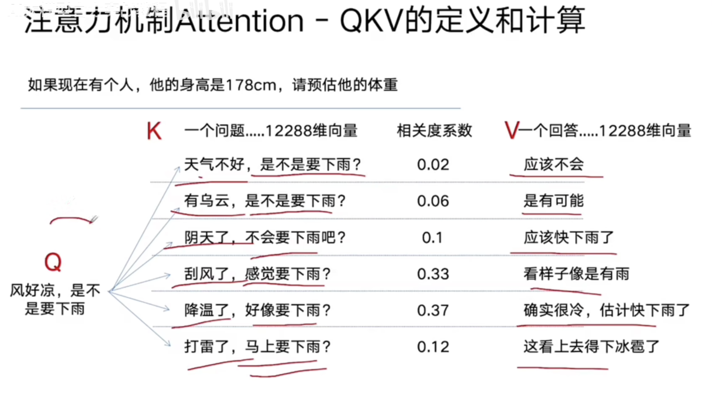

可以并行计算，输入token 是n 计算复杂度为 $n^2$


# 公式

$Attention(Q,K,V)=softmax(\frac{QK^T}{\sqrt{d_k}})\cdot V$

- $d_k$

  维度  512 768 12288

- Q

  query

- K

  每个属性向量

  $Q \cdot   K^T$计算Q和k的相关度

- V: 值


# 自注意力机制 self-attention

如果QKV变成自己本身，就是自注意机制

目的：信息聚合

输入：输入长度*d_model

输出：输入长度*d_model

> <font color="color:rgba(244,63,94,1)">问题：没有神经网络，就没有可训练参数</font>

输入都是embedding，但是qkv计算不包含参数

<font style="color:rgba(245,158,11,1)">输出向量z，神经网络完成某种线性变化，突出一些需要突出的，弱化需要弱化部分</font>

因此更加三个神经网络，$W_q$$W_k$$W_v$， 每个不同层使用不同的 $W_q$$W_k$$W_v$


# 多头自注意力机制

96头表示96个角度分析问题

d_model 12288,  提取出特征 128    [12288,128]

基于一个中心主题词，查看其他词的注意力，最后拼接起来   [96,128]   96*12288  拼接之后,经过一层神经网络  $W_o$ 


1. 线性投影

```python
class LinearProjection(nn.Module):
    def __init__(self, in_dim, out_dim):
        super().__init__()
        self.projection = nn.Linear(in_dim, out_dim)
    
    def forward(self, x):
        return self.projection(x)
```


2. [非线性投影](https://zhida.zhihu.com/search?content_id=251821940&content_type=Article&match_order=1&q=%E9%9D%9E%E7%BA%BF%E6%80%A7&zhida_source=entity)

```python
class NonLinearProjection(nn.Module):
    def __init__(self, in_dim, hidden_dim, out_dim):
        super().__init__()
        self.projection = nn.Sequential(
            nn.Linear(in_dim, hidden_dim),
            nn.ReLU(),
            nn.Linear(hidden_dim, out_dim)
        )
    
    def forward(self, x):
        return self.projection(x)
```

3. 注意力投影

```python
class AttentionProjection(nn.Module):   
    def __init__(self, dim):        
        super().__init__()        
        self.q_proj = nn.Linear(dim, dim)        
        self.k_proj = nn.Linear(dim, dim)        
        self.v_proj = nn.Linear(dim, dim)            
    def forward(self, x):        
        q = self.q_proj(x)        
        k = self.k_proj(x)        
        v = self.v_proj(x)        
        return q, k, v
```