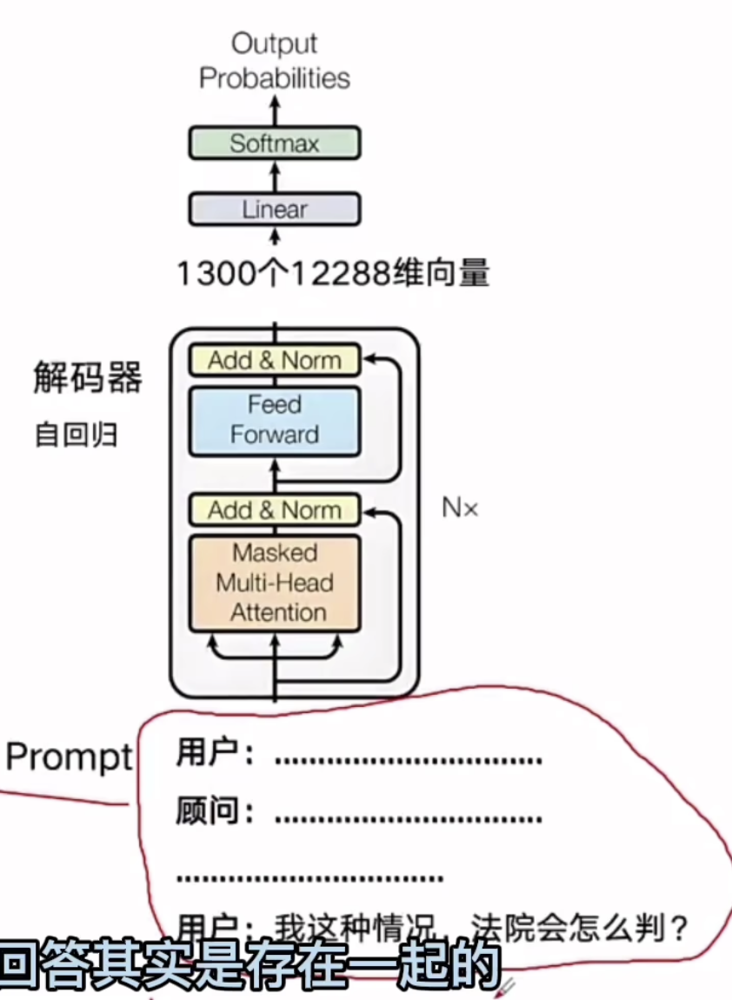

通常层数越多，向量维度越高

过去的方案 RNN 循环神经网络

是一个循环，X0->Z0   z0和X1作为输入计算z1

问题：

- 信息丢失
- 无法处理较长的句子
- 不利于并行计算

# 编码器

用途：一般用来做分析

2017年是6层  

2018年GPT：12层

2020年GPT3: 96层

2023年GPT4: 120层

输入： token

输出：向量

- 多头注意力机制
- 前向传播

# 解码器

最新的大语言模型是decoder only

GPT3 96层

用途：一般用于生成

输入：上一次输出右移+编码器的结果

输出：下一个token的概率

结束符token标识解码器完成工作

- 掩码多头注意力机制
- 多头注意力机制
- 前向传播

# 例子

- 机器翻译任务

首先用encoder生成向量，然后使用解码器decoder，把向量生成一个英文

- 文搜图

通过text encoder生成向量1，通过另外一个image encoder生成向量2；向量1检索向量2  

- 问生图(解码器不是自回归的方式)

  - text encoder把文本生成向量
  - decoder：翻译成图像

# 大模型的decoder only

ormer/.images/OREg5mowKTTVh.png)

