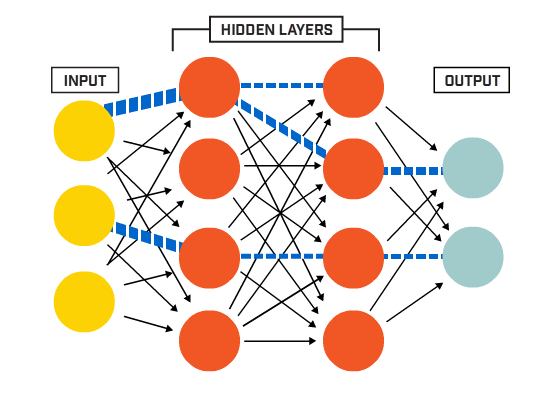
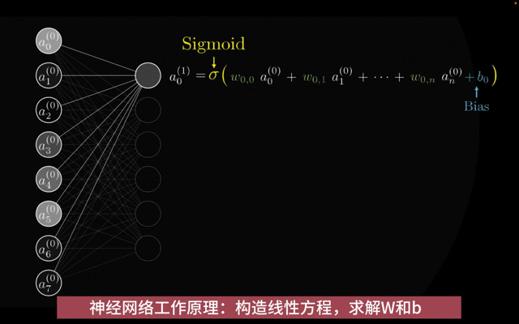
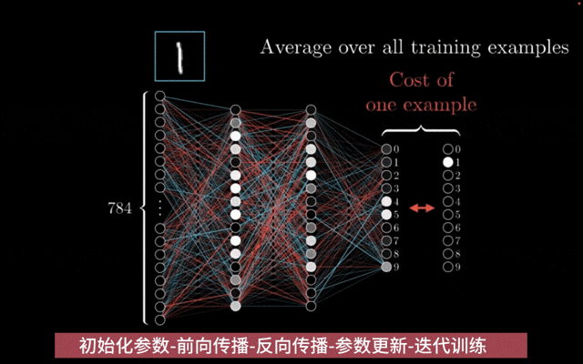
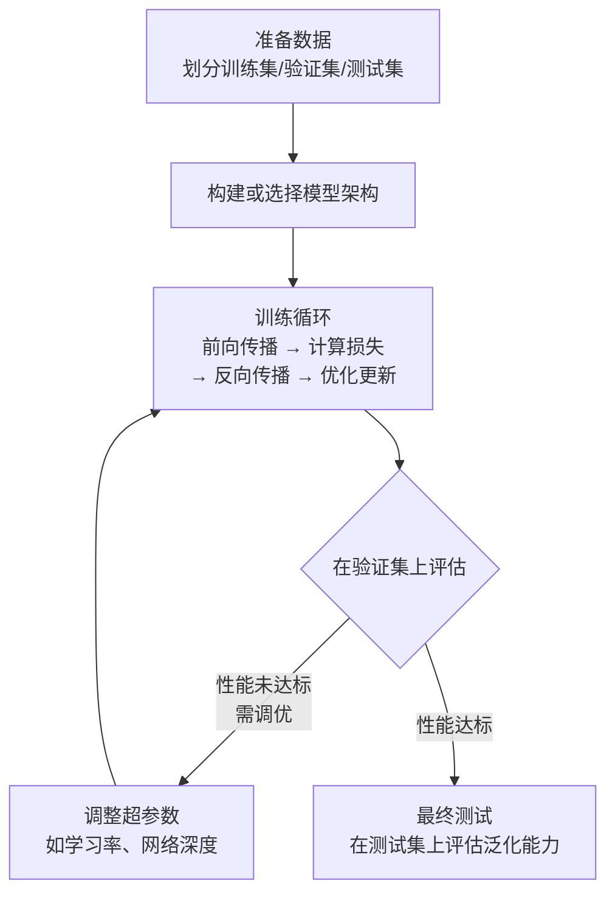

# nlp发展历程

|  年代  |    模型     | 技术特点                          | 核心贡献                                                                                                                                                                                                                                                                                                            | 主要缺陷                                                                                                                                                                                                                     | 后续如何解决                              |
| :----: | :---------: | --------------------------------- | ------------------------------------------------------------------------------------------------------------------------------------------------------------------------------------------------------------------------------------------------------------------------------------------------------------------- | ---------------------------------------------------------------------------------------------------------------------------------------------------------------------------------------------------------------------------- | ----------------------------------------- |
| 90年代 |     HMM     | 统计方法                          | 为序列问题提供了概率图模型框架                                                                                                                                                                                                                                                                                      | 强独立性假设，特征能力弱                                                                                                                                                                                                     | 被CRF取代                                 |
| 90年代 |     CRF     | 统计方法                          | 引入全局特征，判别式模型，效果优于HMM                                                                                                                                                                                                                                                                               | 依赖手工特征工程                                                                                                                                                                                                             | 被神经网络模型取代                        |
|  2010  |     RNN     | 深度学习                          | 端到端学习，自动学习特征表示，处理变长序列                                                                                                                                                                                                                                                                          | 梯度消失，无法处理长依赖                                                                                                                                                                                                     | 被LSTM/GRU解决                            |
|  2012  |    LSTM     | 深度学习                          | 门控机制，有效捕捉长距离依赖                                                                                                                                                                                                                                                                                        | 顺序计算，无法并行，计算复杂                                                                                                                                                                                                 | 被Transformer解决                         |
|  2017  | Transformer | 预训练时代                        | 自注意力，完美长距离依赖，高度并行                                                                                                                                                                                                                                                                                  | O(n²)复杂度，位置信息需编码                                                                                                                                                                                                  | 后续有Longformer, Linformer等改进计算效率 |
|  2018  |    bert     | 迁移学习大规模预训练+任务特定微调 | 为克服传统单向语言模型（如GPT-1）或浅层双向模型（如ELMo）在深度、双向上下文理解上的局限，以及统一各类NLP任务的框架而诞生1. 架构：基于Transformer的双向编码器。2. 预训练任务：掩码语言建模（MLM）与下一句预测（NSP）。3. 输入表示：词嵌入、位置嵌入与段嵌入三者相加。4. 微调范式：预训练后，针对不同下游任务进行微调 | 1. 计算成本高：训练与推理需要大量算力。2. 序列长度限制：通常最多处理512个token，难以处理长文档。3. 知识局限：缺乏真正的常识与推理能力，可能学习到数据中的偏见。4. 可解释性差：作为一个复杂的“黑盒”模型，其决策过程难以理解。 |                                           |
|  2022  |   GPT-3/4   | 超大参数+数据                     | 基于Transformer的自回归语言模型，类人语言能力、多任务统一，确立并证明了超大规模预训练模型的卓越能力与“预训练+提示”新范式                                                                                                                                                                                            | 存在事实性“幻觉”、社会偏见、无法持续学习、在专业领域（如医疗）可能给出危险建议                                                                                                                                               |                                           |

# HMM vs CRF 对比总结

| 方面       | HMM                          | CRF                        |
| ---------- | ---------------------------- | -------------------------- |
| 类型       | 生成式模型                   | 判别式模型                 |
| 目标函数   | P(X,Y) 联合概率              | P(Y\|X) 条件概率            |
| 特征能力   | 有限，只能使用局部特征       | 强大，可以使用任意全局特征 |
| 独立性假设 | 观测独立假设                 | 无独立性假设               |
| 训练方法   | 有监督(最大似然)或无监督(EM) | 有监督(最大似然+正则)      |
| 计算复杂度 | 较低                         | 较高                       |
| 应用场景   | 简单序列标注任务             | 复杂特征依赖的任务         |

## jieba分词

- **早期版本**：在`finalseg`模块中，jieba使用**隐马尔可夫模型**来进行未登录词识别和词性标注。
- **优化版本**：后来，jieba的作者使用**结构化感知机**(CRF简化版)，在相同任务上取得了更好的效果，并替换或作为选项提供。

1. **核心不是CRF**：Jieba分词的**主体和默认机制**是**基于词典的最大概率匹配**，不依赖于任何机器学习模型。
2. **关键辅助是类似CRF的模型**：在解决未登录词这一核心难题时，jieba使用了**结构化感知机**（早期是HMM）。它与CRF同属判别式序列模型家族，思路一脉相承，但更注重工程效率。
3. **工程哲学的体现**：Jieba的设计选择体现了中文分词工具的经典权衡——**利用庞大词典保证基本精度和速度，再借助轻量级统计模型提升对新词的召回能力**。它没有采用重量级的纯CRF模型，而是在效果和效率之间取得了完美平衡。

所以，当你使用`jieba.lcut()`时，你使用的是**词典 + 动态规划 + （结构化感知机/HMM）** 的混合动力系统，而非单纯的CRF算法。

# 深度学习基本概念

## 人工神经网络

- **核心思想**  
  受生物神经网络启发的计算模型，是深度学习的**基础构建单元**。
- **核心组件**

  1. **人工神经元**：接收输入，进行`（加权求和 + 偏置）`，通过**激活函数**产生输出。
  2. **网络层**：多个神经元构成一层（输入层、隐藏层、输出层）。
  3. **连接权重**：决定信号传递的重要性。

FFNN/Mutilayer Perceptron

***

## 学习过程：前向与反向传播

- **前向传播**  
  **数据流向**：输入 → 隐藏层 → 输出  
  **作用**：执行一次预测，计算当前模型的输出结果。
- **反向传播**  
  **数据流向**：输出（误差）→ 隐藏层 → 输入  
  **作用**：根据预测误差，逆向计算每个参数（权重）对误差的“贡献度”（梯度），是模型**学习的关键**。

***

## 衡量与改进：损失函数与优化器

- **损失函数**  
  **作用**：量化模型预测值与真实值之间的**差距**。  
  **常见类型**：

  - **均方误差**：用于回归问题（如预测房价、温度）。
  - **交叉熵损失**：用于分类问题（如图像识别、垃圾邮件分类）。

- **优化器**  
  **作用**：根据反向传播计算的梯度，**具体执行参数更新**的算法。  
  **核心代表**：**随机梯度下降** 及其智能变体 **Adam**。

***

## 赋予非线性：激活函数

- **为什么必不可少？**  
  为神经元引入**非线性变换**。没有它，深层网络将退化为简单的线性模型，无法学习复杂模式。
- **常见类型**

  1. **Sigmoid**：早期常用，易导致梯度消失。
  2. **Tanh**：输出以0为中心，性能略有改善。
  3. **ReLU**：最常用，计算简单，有效缓解梯度消失问题。

***

## 避免“死记硬背”：过拟合与正则化

- **过拟合**  
  **现象**：模型在训练集上表现完美，在未见过的数据上表现糟糕。  
  **比喻**：“死记硬背答案，而非理解原理”。
- **正则化（解决方案）**

  1. **L1/L2正则化**：在损失函数中增加对权重的惩罚项，防止其过大。
  2. **Dropout**：在训练中随机“关闭”部分神经元，迫使网络学习更稳健的特征。

***

## 标准工作流：模型训练流程

一个典型的深度学习项目遵循以下循环流程：

---

## **总结与延伸**

- **核心关系总结**  
  **人工神经网络**是骨架，**前向/反向传播**是学习机制，**损失函数**是目标，**优化器**是执行者，**激活函数**提供非线性能力，**正则化**确保泛化。
- **与前沿模型的联系**  
  所有这些基础概念，共同构成了理解 **CNN（计算机视觉）、RNN/LSTM（序列处理）、Transformer/BERT/GPT（预训练大模型）** 等复杂架构的基石。
- **下一步探索方向**  
  深入任何一个具体概念（如优化器原理），或探究这些基础如何在不同领域架构中应用。

# transformer：encoder&decoder

# bert架构

<a href=".images/bert%E5%9F%BA%E7%A1%80.md" download data-size="6698">bert基础.md</a>

# bert应用

## 分类任务

## bi-encoder&cross-encoder