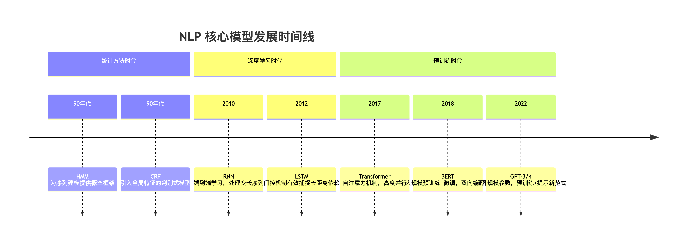

|  年代  |    模型     | 技术特点                          | 核心贡献                                                                                                                                                                                                                                                                                                            | 主要缺陷                                                                                                                                                                                                                     | 后续如何解决                              |
| :----: | :---------: | --------------------------------- | ------------------------------------------------------------------------------------------------------------------------------------------------------------------------------------------------------------------------------------------------------------------------------------------------------------------- | ---------------------------------------------------------------------------------------------------------------------------------------------------------------------------------------------------------------------------- | ----------------------------------------- |
| 90年代 |     HMM     | 统计方法                          | 为序列问题提供了概率图模型框架                                                                                                                                                                                                                                                                                      | 强独立性假设，特征能力弱                                                                                                                                                                                                     | 被CRF取代                                 |
| 90年代 |     CRF     | 统计方法                          | 引入全局特征，判别式模型，效果优于HMM                                                                                                                                                                                                                                                                               | 依赖手工特征工程                                                                                                                                                                                                             | 被神经网络模型取代                        |
|  2010  |     RNN     | 深度学习                          | 端到端学习，自动学习特征表示，处理变长序列                                                                                                                                                                                                                                                                          | 梯度消失，无法处理长依赖                                                                                                                                                                                                     | 被LSTM/GRU解决                            |
|  2012  |    LSTM     | 深度学习                          | 门控机制，有效捕捉长距离依赖                                                                                                                                                                                                                                                                                        | 顺序计算，无法并行，计算复杂                                                                                                                                                                                                 | 被Transformer解决                         |
|  2017  | Transformer | 预训练时代                        | 自注意力，完美长距离依赖，高度并行                                                                                                                                                                                                                                                                                  | O(n²)复杂度，位置信息需编码                                                                                                                                                                                                  | 后续有Longformer, Linformer等改进计算效率 |
|  2018  |    bert     | 迁移学习大规模预训练+任务特定微调 | 为克服传统单向语言模型（如GPT-1）或浅层双向模型（如ELMo）在深度、双向上下文理解上的局限，以及统一各类NLP任务的框架而诞生1. 架构：基于Transformer的双向编码器。2. 预训练任务：掩码语言建模（MLM）与下一句预测（NSP）。3. 输入表示：词嵌入、位置嵌入与段嵌入三者相加。4. 微调范式：预训练后，针对不同下游任务进行微调 | 1. 计算成本高：训练与推理需要大量算力。2. 序列长度限制：通常最多处理512个token，难以处理长文档。3. 知识局限：缺乏真正的常识与推理能力，可能学习到数据中的偏见。4. 可解释性差：作为一个复杂的“黑盒”模型，其决策过程难以理解。 |                                           |
|  2022  |   GPT-3/4   | 超大参数+数据                     | 基于Transformer的自回归语言模型，类人语言能力、多任务统一，确立并证明了超大规模预训练模型的卓越能力与“预训练+提示”新范式                                                                                                                                                                                            | 存在事实性“幻觉”、社会偏见、无法持续学习、在专业领域（如医疗）可能给出危险建议                                                                                                                                               |                                           |

# HMM vs CRF 对比总结

| 方面       | HMM                          | CRF                        |
| ---------- | ---------------------------- | -------------------------- |
| 类型       | 生成式模型                   | 判别式模型                 |
| 目标函数   | P(X,Y) 联合概率              | P(Y\|X) 条件概率            |
| 特征能力   | 有限，只能使用局部特征       | 强大，可以使用任意全局特征 |
| 独立性假设 | 观测独立假设                 | 无独立性假设               |
| 训练方法   | 有监督(最大似然)或无监督(EM) | 有监督(最大似然+正则)      |
| 计算复杂度 | 较低                         | 较高                       |
| 应用场景   | 简单序列标注任务             | 复杂特征依赖的任务         |

