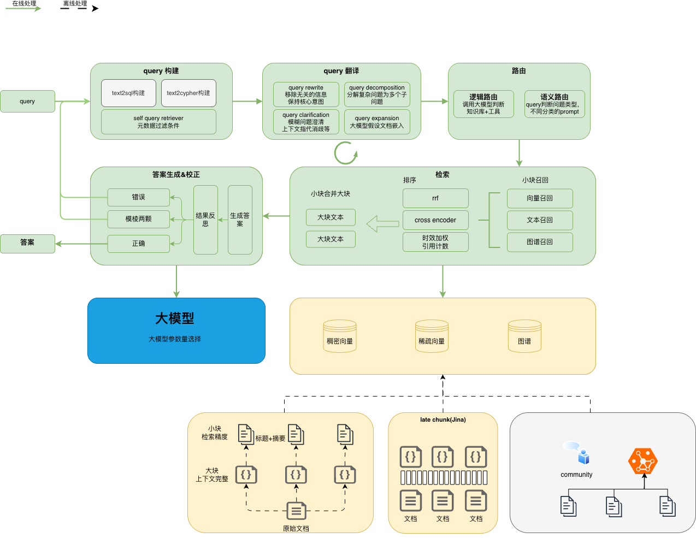
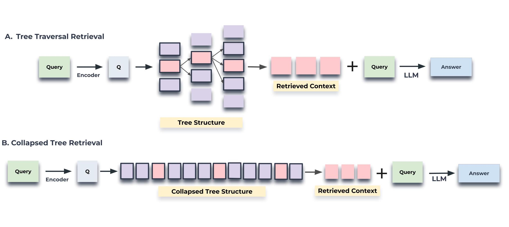
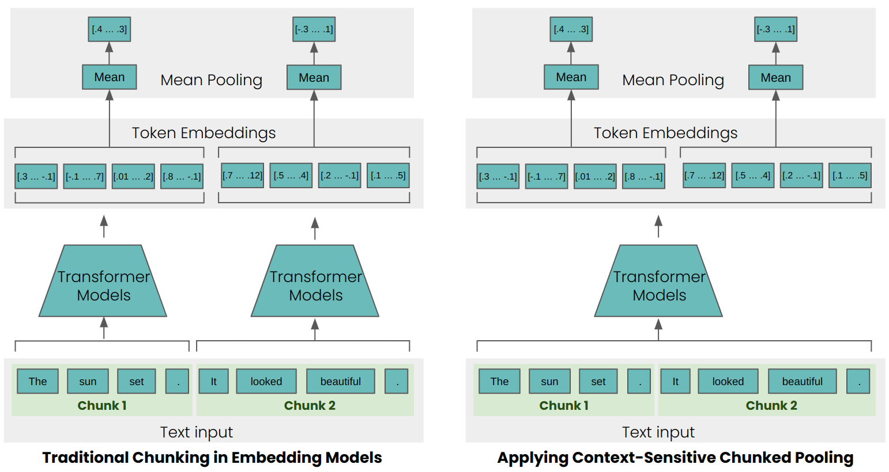
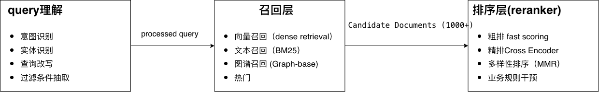
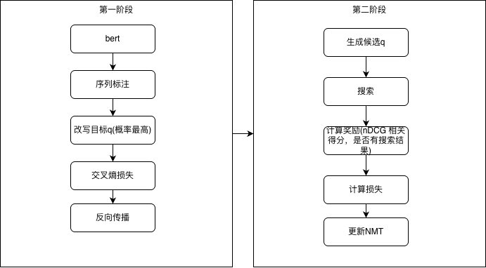

# 一、产品

## 1.1 宙斯搜索问答平台

**定位**：通用型 RAG 搜索问答基础设施

### 搜索能力

- **文档解析**：
  
  - 支持 10+ 种格式（PDF、Word、Excel、PPT、Markdown、HTML 等）

- **文本切片**：
  
  - 基于规则（标题、段落、固定长度）
  - 基于视觉模型（LayoutLM 等识别文档结构）

- **索引构建**：
  
  - 向量索引：稀疏向量 (SPLADE) + 稠密向量 (BGE/M3) + Late Chunking
  - 文本索引：BM25/倒排索引
  - 知识图谱索引：实体关系三元组

- **排序**：
  
  - 多路召回融合
  - RRF（Reciprocal Rank Fusion）
  - Reranker 重排序

### 问答能力

- 多租户管理
- 大模型配置（支持主流 LLM 接入）
- 知识库管理
- **限制**：不支持流程编排

### 技术亮点

- 跨语言检索精度提升 **2%**（通过多语言向量 + 翻译）
- 支持 Global（主题级）和 Local（详情级）双层召回

## 1.2 统一搜索员工askbob

**定位**：定制化场景搜索解决方案

**核心能力**：

- 多数据源整合（数据库、文档、API 等）
- 深度语义理解（意图识别、实体识别、词权重）
- 场景化查询改写(通用改写+基本法+联系人改写等)
- 多路召回策略（向量 + 文本 + [图谱]）
- 多层次排序（粗排 → 精排 → 多样性重排）
- 规则干预与业务定制
- 埋点分析与运营系统

**应用场景**：人事搜索、it知识库、公文新闻检索等垂直场景

***

# 二、系统设计

## 2.1 宙斯RAG 流程



### 2.1.1 RAPTOR 层次化索引

- layoutLM 段落布局切片
- 父子块关联 Chunk + Parent Document
- 生成摘要(摘要和切片索引)和假设性问题
- 无gmm聚类




**优势**：

- 支持不同粒度召回
- 父块召回后可下钻到子块
- 检索回答宏观问题（书籍类）

### 2.1.2 知识图谱构建(完善中)

用于通讯录，领导卡片和人事搜索问答领域

**流程**：

```
文档 → 实体抽取 → 关系抽取 → 实体链接 + 三元组存储 → 社区发现(leide)
```

**应用**：

- Global 类问题由社区描述直接回答
- 支持多跳推理（A→B→C）

**示例**：

```json
{
  "head": "张三",
  "relation": "任职于",
  "tail": "银行人事部"
}
```

### 2.1.3 Late Chunking 技术

**传统方式**：

```
长文本 → 切分为小段 → 分别编码 → 丢失全局信息
```

**Late Chunking**：



```
长文本 → 整体编码（保留全局信息）→ Pooling → 拆分小切片向量
```

**优势**：

- 捕捉跨段落的语义关联
- 适合长文档检索，解决文档级别的指代问题

### 2.1.4 混合向量索引

- **稠密向量**：BGE-M3 / M3E（语义相似度）
- **稀疏向量**：SPLADE（关键词增强）
- **效果**：跨语言检索精度提升 2%

### 2.1.5. 查询理解 (Query Understanding)

- **意图识别**：区分 Global（全局问题总结）vs Local（具体问题详情）
  
  - Global 示例："公司有哪些福利政策？"
  - Local 示例："我的年假还剩几天？"

- **实体识别**：
  
  - 提取关键信息（人名、部门、时间、地点）

- **查询改写**：
  
  - 指代消解（"它" → 具体对象）
  - 信息补全（补充隐含条件）
  - 复杂问题拆解（多跳问题分解）

### 2.1.6. 搜索召回 (Retrieval)

**多路召回策略**：

- 稠密向量召回（语义相似度）
- 稀疏向量召回（splade）
- BM25 文本召回
- 知识图谱召回（实体关联）

**排序融合**：

- RRF（Reciprocal Rank Fusion）：$score(d) = \sum_{i=1}^n 1/(k + rank_i)$
- 加权融合：向量 70% + BM25 30%
- cross-encoder

### 2.1.6 答案生成 (Generation)

**挑战**：Lost in the Middle 现象（模型忽略中间内容）

**解决方案**：

- Context 重排序（重要信息放两端）
- Context 压缩（去除冗余）
- 分块生成 + 汇总

### 2.1.7 反思生成 (Reflection)

- 自检答案质量
- 低置信度时触发二次检索
- 多轮迭代优化

### 2.1.8 引文生成 (Citation)

基于ROUGE指标统计方式生成引文(后期版本大模型自己标注，速度快)

## 2.2 搜索流程



#### 2.2.2. 问题改写 (Query Rewriting)

**目标**：将用户自然语言转换为高召回率的搜索查询

**技术方案**：NMT + 强化学习（详见第三章）

**示例**：

```
原始 query: "电脑登录不了，没法办公了"
↓
改写后： "办公电脑密码过期、账号解锁"
```

#### 2.2.3 多样性排序

目标： 多数源情况下排序多样性确保

技术方案： 最大边界相关性，损失函数结合ndcg和相关性得分   

***

# 三、核心算法优化

## 3.1 查询改写：NMT + 强化学习

> 技术方案来源：美团搜索 ~2020 年论文

### 核心思想

将搜索改写视为**神经机器翻译任务**：

- **源语言**：用户原始查询（通常不不规范、口语化）
- **目标语言**：高性能搜索查询（规范、易召回）
- **奖励信号**：搜索结果质量（点击率、排名、相关性）



### 技术架构：两阶段优化

#### 第一阶段：监督学习预训练 (Supervised Learning)

**模型结构**：Encoder-Decoder（Transformer）

**训练目标**：最小化交叉熵损失

**数据示例**：

```python
train_data = [
    ("寿改", "寿险改革"),
    ("拧毛巾", "清洗毛巾"),      # 负例：语义改变
    ("vpn 到期了怎么办", "vpn 申请链接"),
    ("电脑登录不了", "忘记密码"),
]
```

**挑战**：缺少 Decoder 预训练模型

- BERT/MacBERT 是 Encoder-only 架构
- 无法直接用于序列生成任务

#### 第二阶段：强化学习微调 (Reinforcement Learning)

**为什么需要 RL？**

- 搜索指标（nDCG、CTR）不可导
- 无法通过反向传播直接优化
- RL 可通过策略梯度方法优化离散生成任务

**RL 三要素**：

1. **状态 (State)**: 原始查询 q + 已生成的词
2. **动作 (Action)**: 下一个词的选择
3. **奖励 (Reward)**: 搜索结果质量评估

**奖励函数设计**：

```python
R = α * NDCG@10 + β * MRR + γ * UserFeedback

# 示例计算
if 点击量高 and 跳出率低:
    R = 1.0  # 优秀
elif 跳出率高 or 点击量低:
    R = -0.5  # 较差
else:
    R = 0.0  # 一般
```

**联合损失函数**：

```
L_total = λ * L_RL + (1-λ) * L_MLE

# 作用：防止 RL 导致模型坍塌（生成病态但高分的查询）
```

### 实现挑战与解决方案

#### 问题 1：序列长度不一致

**场景**：

```
源序列："vpn 到期"  (2 个词)
目标序列："vpn 续期申请" (4 个词)
```

传统 Seq2Seq 模型要求输入输出等长，无法直接处理。

#### ✅ 解决方案：Align with Insert 标记

**步骤**：

```python
# 示例："vpn 到期" → "vpn 续费申请"

# 步骤 1: 序列对齐
源：["vpn", "到期"]
目标：["vpn", "续", "期", "申请"]

# 步骤 2: 使用编辑距离算法建立对齐
对齐结果：[
    ("vpn", "vpn"),        # 保持
    ("<INS>", "续"),       # 插入
    ("<INS>", "期"),       # 插入
    ("到期", "申请")        # 替换
]

# 步骤 3: 构建新的输入序列
新输入：["vpn", "<INS>", "<INS>", "到期"]
新目标：["vpn", "续", "期", "申请"]
```

**优势**：

- 将变长生成问题转化为等长序列标注任务
- 可直接使用 BERT/MacBERT 等预训练模型
- 支持插入、删除、替换操作

**数据格式**：

```json
{
  "input": ["vpn", "<INS>", "<INS>", "到期"],
  "labels": ["vpn", "续", "期", "申请"],
  "loss_mask": [0, 1, 1, 1]  // 只有<INS>位置计算损失
}
```

**详细实现参考**：

- [macbert_query_rewrite_train.py](./macbert_query_rewrite_train.py)[macbert_query_rewrite_train.py](./macbert_query_rewrite_train.py)
- [`align_with_insert 训练数据样例.md`](./align_with_insert 训练数据样例.md)

### 训练流程

```python
trainer = TwoStageTrainer(model_name="hfl/chinese-macbert-base")

# 阶段 1: SL 预训练
pretrained_path = trainer.stage1_supervised_learning(
    train_data=train_pairs,
    val_data=val_pairs
)

# 阶段 2: RL 微调
rl_model = trainer.stage2_reinforcement_learning(
    pretrained_model_path=pretrained_path,
    search_engine_fn=real_search_api,  # 真实搜索引擎
    reward_fn=search_metric_reward
)
```

## 3.2 多样性排序 (Diversity Ranking)

### 问题背景

传统排序只关注**相关性**，导致Top结果高度相似：

问题：全部来自同一数据源（限额说明），覆盖度不足

### 方案：MMR (Maximum Marginal Relevance)

**经典算法**（Airbnb 论文）：

$score(q, d_i) = λ * Rel(q, d_i) - (1-λ) * max_{j<i} Sim(d_i, d_j)$

含义：

- Rel(q, d_i): 与查询的相关性

- Sim(d_i, d_j): 与已选文档的相似度

- λ: 平衡参数 (通常 0.7-0.8)

> 实际线上为了降低开销，直接基于同一数据来源的数据进行惩罚

## 3.3 实体识别 (NER)

### 技术方案：BERT + Pointer Network

**模型架构**：

```
Input → BERT Encoder → Pointer Network → (Start, End) 位置
```

**相比传统 BIO 标注的优势**：

- 直接预测实体的起止位置
- 避免误差累积（B-I-O 标签链式依赖）
- 支持嵌套实体

**数据格式**：

```json
{
  "text": "谁是银行人事负责人",
  "entities": [
    {"type": "ORGANIZATION", "start": 2, "end": 3, "text": "银行"},
    {"type": "DEPARTMENT", "start": 4, "end": 5, "text": "人事"},
    {"type": "POSITION", "start": 6, "end": 8, "text": "负责人"}
  ]
}
```

**训练技巧**：

- 使用 MacBERT 替代 BERT（M LM 预训练任务更优）
- 多任务学习：NER + 关系抽取联合训练
- 数据增强：同义词替换、回译

**效果对比**：

| 模型              | Precision | Recall    | F1        |
| --------------- | --------- | --------- | --------- |
| BERT-BIO        | 85.2%     | 82.1%     | 83.6%     |
| MacBERT-Pointer | **88.7%** | **86.3%** | **87.5%** |

**详细实现参考**：[NER/](../NER/)[NER/](../NER/) 目录

***

# 四、优化 (2026)

### 第一阶段：基础能力加固（Q1-Q2）

| 项目               | 时间  | 目标           | 关键结果                                  |
| ---------------- | --- | ------------ | ------------------------------------- |
| **搜人场景优化**       | 3 月 | 提升人事搜索准确率    | - Query改写纠错<br/>- 通讯录模糊匹配<br/>        |
| **Agentic 框架改造** | 4 月 | 支持 Skills 扩展 | - 实现工具调用接口<br/>- 支持工作流编排<br/>- 万能服务路由 |

**预期收益**：

- 人事场景 Badcase 减少 50%

### 第二阶段：智能化升级（Q2-Q3）

| 项目         | 时间  | 目标         | 关键结果                 |
| ---------- | --- | ---------- | -------------------- |
| **知识图谱构建** | 6 月 | 大模型自动抽取 KG | - 实体关系抽取准确率>85%      |
| **记忆模块**   | 8 月 | 用户画像与历史上下文 | - 个性化召回<br/>- 对话状态追踪 |

**技术亮点**：

```python
# DeepResearch 示例
Query: "张三是哪个部门的？他的上级是谁？"
↓
分解：
  1. 查询张三的部门 → 人事部
  2. 查询人事部的负责人 → 李四
  3. 返回：张三属于人事部，上级是李四
```

### 第三阶段：技术探索（Q3-Q4）

| 项目                       | 时间  | 目标      | 关键结果                              |
| ------------------------ | --- | ------- | --------------------------------- |
| **Reason Rank**          | 8 月 | 推理感知排序  | - 7B 模型超越 32B 效果- 引入思维链验证         |
| **Tree Structure Index** | 8 月 | 层次化召回实验 | - 支持父子节点联合检索<br/>- 长尾 Query 召回率提升 |

**创新点**：

- **Reason Rank**: 让 Reranker 具备推理能力
  
  ```
  Query: "预算审批流程"
  传统 Reranker: 匹配关键词
  Reason Rank: 推理出需要"流程图 + 审批权限 + 时间节点"
  ```

- **Tree Index**: 模仿人类查阅文档的方式
  
  ```
  文档树：根节点 (手册) → 分支 (章节) → 叶子 (段落)
  检索：先定位章节，再精确定位段落
  ```

***

# # 五、资源需求与风险评估

## 5.1 人力资源

人力变动较大 ，离职1内算法 1外算法，1测试

| 角色    | 人数  | 投入周期  | 主要职责             |
| ----- | --- | ----- | ---------------- |
| 算法工程师 | 2-3 | 全年    | 模型训练与优化          |
| 工程开发  | 2   | Q1-Q2 | 图谱构建和agentic框架开发 |

## 5.2 监控看板

```
实时大盘：
├─ 搜索 PV/UV
├─ 数据对接情况
|─ 实时告警
└─ 数据分布
```

***

# 六、总结与展望

## 9.1 核心技术沉淀

✅ **查询改写**: NMT+RL 两阶段优化框架  
✅ **多样性排序**: MMR
✅ **实体识别**: BERT+Pointer Network 高精度方案  
✅ **索引构建**: RAPTOR + Late Chunking + 知识图谱

## 9.2 技术趋势

### Agentic Search

- 从"搜索 - 回答"升级为"搜索 - 行动"

### Multimodal RAG

- 图文混排检索
- 视频内容理解
- 跨模态推理