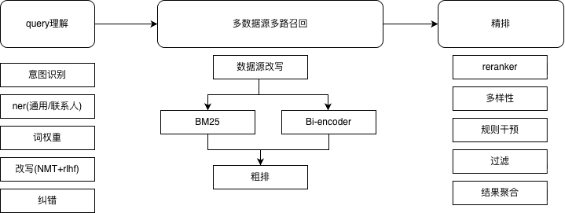

# 1. 搜索问答产品

1. 统一搜索  
   定制化场景搜索产品，包含搜索服务、埋点分析、运营系统等能力，支持多数据源意图识别、实体识别、词权重、基于场景改写、多路召回、粗排、精排以及多样性排序、规则干预等

2. 宙斯搜索问答  
   通用搜索问答平台：
   
   - 搜索：  
     支持10种文档解析、文本切片(基于规则和视觉模型)、向量(稀疏+稠密+late chunking等)+文本+(图谱)索引构建、多路找回、rrf排序融合、reranker；
   - 问答：  
     支持多租户、模型配置、知识库配置等，不支持流程编排

# 2. 搜索架构

## 系统架构图

## rag流程


global主题召回

1. 查询理解  
   意图识别：全局问题总结类还是local问题详情召回  
   过滤条件抽取：关键实体 时间、地点 等

2. 问题改写：生成扩展问
   
   - 指代消解
   - 信息补全
   - 复杂问题拆解

3. 搜索：基于全局主题、local问题详情 召回等  
   稀疏+稠密RRF融合排序  
   向量+BM25 reranker 或者 7:3 权重

4. 答案生成：根据问题生成答案  
   lost in middle

5. 反思生成：循环

6. 引文生成

### 索引构建

1. RAPTOR 层次结构
- 总结块
- 父子块
- 聚类(无)
2. 标题摘要
3. 图谱构建  
   构建三元组  
   抽取社区即主题聚类，global类问题由社区描述回答
4. 向量[稀疏+稠密]+BM25  
   提升精度，跨语言检索提升2%
5. late chunking

### late chunking

基于长上下文的训练、生成token向量，拆分小切片后 通过一个池化层捕捉全局信息  


## 搜索流程



# 3.搜索主要问题分析

# 4. 搜索问答主要算法优化

## 改写 NMT+强化学习 （美团~20年论文）

将搜索改写视为一个翻译过程（将“原始查询”翻译为“高性能查询”），并利用搜索结果的反馈作为奖励信号


### 算法原理：两阶段优化框架

采用 **“先监督预训练，后强化微调”** 的架构。

### 第一阶段：NMT 基础模型 (监督学习)

使用编码器-解码器结构。模型学习将用户输入的 Query ($q$) 映射到目标改写 Query ($q^*$)。

- **编码器**：捕捉原始 Query 的语义表示。接收原始搜索词 $q$（例如：“电脑登录不了，没法办公了”），将其转化为高维语义向量。
- **解码器**：生成改写后的候选 Query。基于 Encoder 的输出，逐词预测（Sampling）生成改写后的查询 $q'$（例如：“办公电脑密码到期”）。在 RL 阶段，它是我们的 Policy $\pi_{\theta}$。

### 第二阶段：RL 性能增强 (策略梯度)

NMT 模型作为策略网络（Policy Network）。由于搜索指标（nDCG）不可导，无法通过反向传播直接优化，因此引入强化学习：

1. **动作 (Action)**：模型生成的改写序列 $q'$。
2. **状态 (State)**：原始查询 $q$ 及已生成的词。
3. **奖励 (Reward)**：将 $q'$ 投入搜索引擎，根据返回结果的质量（排序位置、点击率、相关性得分）计算奖励值。

点击量高, 跳出率低 (R=1.0)  
跳出率高, 点击量低 无数据 (R=-0.5)

#### 联合损失

保留部分 MLE 约束：  
$L_{total} = \alpha L_{RL} + (1-\alpha) L_{MLE}$

### 实现问题以及方案

- 问题：
1. 缺少解码器的预训练模型, 采用bert macbert模型的做序列标注任务，对输入序列的每个位置进行词表级别的分类，选择概率最高的词作为改写结果，使用交叉熵损失（Cross-Entropy），但引入序列长度问题

```python
train_data = [
    ("寿改", "寿险改革"),
    ("拧毛巾", "清洗毛巾"), # 负例
    ("vpn 到期了怎么办", "vpn 申请链接"),
    ("电脑登录不了", "电脑无法登录"),
    # ... 更多数据
]
```

- 方案：  
  采用 **对齐 + 插入标记（align_with_insert）** 方式的完整训练数据样例和预测结果示例。在源序列中添加 `<INS>` 标记来表示需要插入的位置，将长度不一致的问题转化为等长序列的预测问题。

```python
# 示例： "vpn 到期" → "vpn 续费申请"
步骤 1: 序列对齐
源： ["vpn", "到期"]
目标：["vpn", "续", "费", "申请"]

步骤 2: 使用编辑距离算法建立对齐
对齐结果：[("vpn","vpn"), ("<INS>","续"), ("<INS>","费"), ("到期","申请")]

步骤 3: 构建新的输入序列

新输入：["vpn", "<INS>", "<INS>", "到期"]
新目标：["vpn", "续", "费", "申请"]
```

## 多样性排序

1. reranker的微调，list-wise损失函数结合数据源覆盖度；  
   后续切换成pair-wise损失函数
2. airbnb论文 （~20年论文）

## 实体识别

采用bert+指针网络结构，优化by token的BE

```json
{
  "text": "谁是银行人事负责人",
  "entities": [
    {"type": "ORGANIZATION", "start": 2, "end": 3, "text": "银行"},
    {"type": "DEPARTMENT", "start": 4, "end": 5, "text": "人事"},
    {"type": "POSITION", "start": 6, "end": 8, "text": "负责人"}
  ]
}
```

# 5.接下来的工作

| 序号  | 项目                                             | 预计完成 |
| --- | ---------------------------------------------- | ---- |
| 1   | 优化搜人场景，query改写纠错                               | 3月   |
| 2   | 搜索聚类，优化搜索结果多样性                                 | 4月   |
| 3   | agentic 服务框架改造                                 | 4月   |
| 4   | 大模型构建知识图谱+deepresearch多跳问题答案生成                 | 6月   |
| 5   | 记忆模块和图结构上下文优化                                  | 8月   |
| 6   | Reason rank和multiview ranking reward 7b超过32b效果 | 8月   |
| 7   | tree structure index 召回实验                      | 8月   |