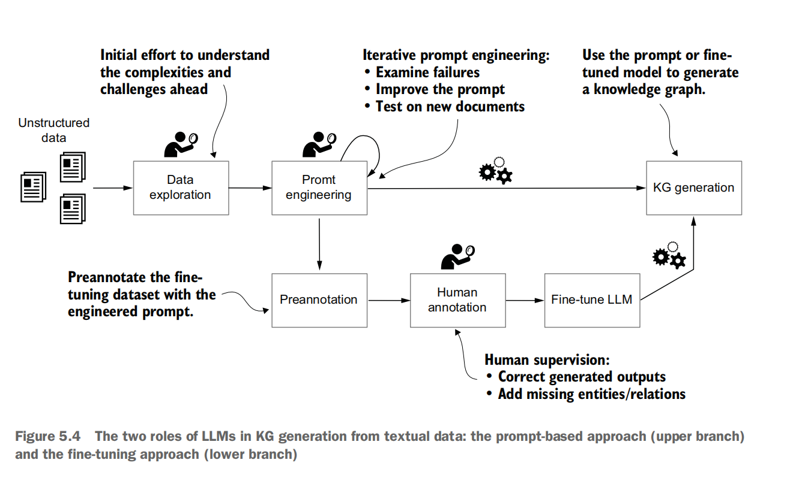

基于prompt的图谱




````
NER:
RE:
coreference resolution:
entity resolution:
disambiguation:

````


## prompt_v1

定义输出格式

````
"""You are an expert on constructing Knowledge
Graphs from texts using named entity recognition and relation extraction.
Given a prompt, identify as many entities and relations among them as possible and output a list of relations in the format [ENTITY 1, ENTITY 1 TYPE, RELATION, ENTITY 2, ENTITY 2 TYPE].
The relations are directed, so the order matters."""
````


## 如何解决归一化的问题

The four research topics from this paragraph

have been assigned three different labels: field, research, theory. In essence, they

are correct. But what are they really? They are all research topics of Professor

Andrews, so a human might call each one a topic or occupation and have a single

corresponding node label in the graph for all of them.

So, let’s test a new version of the prompt, shown in listing 5.4. To address the nor

malization issue, **we include lists of entity classes and relation types**, **including explanations of some of the underperforming relation types.**


规范化的问题：包含实体类和关系类型，并对表现欠佳的关系类型进行了描述


## prompt_v2

限定关系：Top relations of interest:

说明简写

````
prompt_segments['task'] = """

...

Entities of interest: person, location, organization, date, occupation
(a.k.a. person's work, specialization, research discipline, interests,
occupation, technology).
Top relations of interest:  "works for", "works with", 
"student of" (link students with their teachers/advisors), "talked about"
(a person talking about another person), "talked with" (a person talking
with another person), "works on" (assignment of persons to
their occupation, work, specialization, research
discipline, interests etc.).

Note that persons are often first referenced by their full name, and
 then mentioned only by their surname or initials, for example: "A. N. 
 Richards" becomes "Richards", "ANR", or just "R.". 
Note that organizations (universities, their departments) are often
shortened, for example: "University of California" is written as "U. of
Cal." or just "U. Cal.", "Department of Physics" is written as "Dept.
Phys." etc."""

````


## 模型评测

Then calculate per-class **precision, recall, and F1 score** for entities and relations. When you get to the point that, despite all your best efforts, prompt engineering is not yielding satisfactory results, **it’s better to invest the remaining project time in fine-tuning the LLM rather than making never-ending prompt improvements.**


