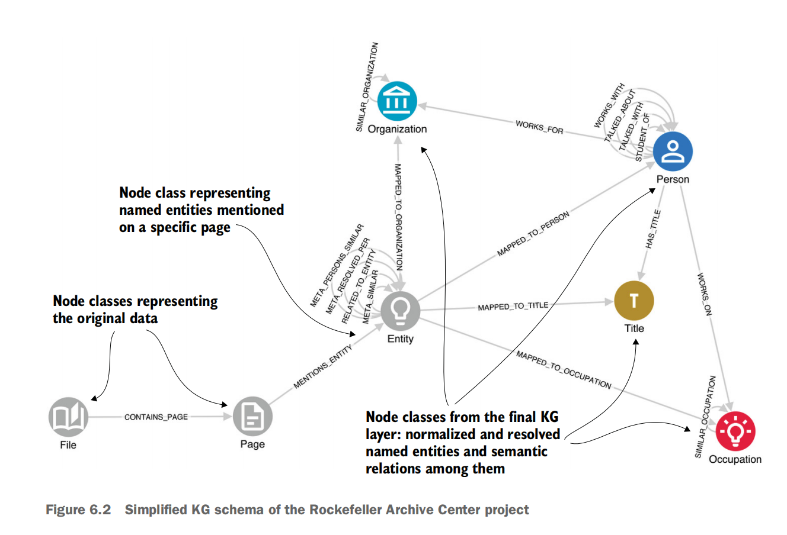
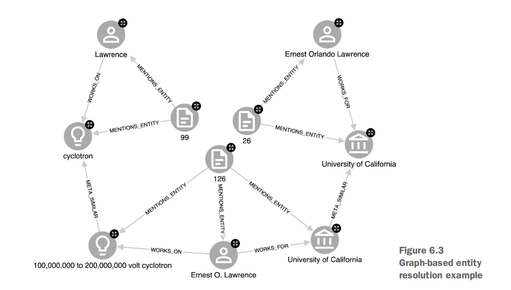

# 第六章


## 文档到图：

### 图建模

We decided to design the graph in three layers:

- **Document-level layer**

  The result of initial data ingestion. Each diary file is represented as a File node with properties such as file name, location, and author; and each Page node, as result of extraction from each file by the OCR model, with properties such as the final clean text of the page.


- **Metagraph layer**

  Unmerged GPT entities (Entity nodes) and relations among them, as well as their linkage to the original page from which they were extracted.


-  **KG layer**

  Final, normalized, cleansed resolved entities (Person, Title, Organization, Occupation) and relations among them (WORKS_ON, WORKS_FOR, etc.).




Entity 到自己的连接是什么意思，相似？中间的相似

这里的文件和页面为什么不作为属性 而作为实体存在？


### 构造元图

the first step is to define a chunking strategy to avoid running into the max tokens limit or deteriorating processing quality for very long texts. Here we show the simplest approach: splitting by page.

抽取的都是实体类 Entity 包含一个属性name，只是抽取不合并；所有已识别的实体提及（在模式中称为具有属性名称的实体节点），将其链接到对应页面，并根据页面内容提取关系（称为“关联实体”，其类型属性表示关系类别）。

这种设计 **好处** 既能轻松追踪图中节点和关系的来源，又可随时通过元图重新构建知识图谱，从而根据需要进行实体解析的微调。

### 归一化和清洗

一旦元图构造好，统计top entities per class，关系类型；忽略大小写，称呼名字中包含title等(occasionally)included a person’s title as part of their name, even though it was instructed to treat

them separately


规范人和职业的实现

```python
from neo4j import GraphDatabase
URI = "bolt://localhost:7687"
AUTH = ("neo4j", "password")
NEO4J_DB = "neo4j"
REMOVE_TITLES = ["dr.", "prof.", "dean", "president", "pres.", "sir", 
"mr.", "mrs."] 
QUERY_NORM_PERSONS = """ 
 MATCH (e:Entity {label: "Person"})
 WITH e, CASE WHEN ANY(title IN $remove_titles WHERE toLower(e.name)
 STARTS WITH title) THEN apoc.text.join(split(e.name, " ")[1..], " ")
 ELSE e.name END AS name
 SET e.name_normalized = name
"""
QUERY_NORM_OCCUPATIONS = """ 
MATCH (e:Entity {label: "Occupation"})
ET e.name_normalized = toLower(e.name)
"""
if __name__ == "__main__":
    with GraphDatabase.driver(URI, auth=AUTH) as driver:
    with driver.session(database=NEO4J_DB) as session: 
    print("Normalizing Person names")
    session.run(QUERY_NORM_PERSONS, remove_titles=REMOVE_TITLES)
    print("Normalizing Occupations")
    session.run(QUERY_NORM_OCCUPATIONS)
```

We create new node properties called `name_normalized`, which will be later used instead of unnormalized name properties when linking to final nodes in the KG layer.、

创建一个新的属性 `name_normalized` 以后替换 `name` 属性

### 基于图的实体对齐 entity resolution 

**实体对齐( entity alignment)** 也称为实体匹配(entity matching)或实体解析(entity resolution) 是判断相同或不同数据集中的2个实体是否指向真实世界同一对象的过程

Most of the entity mentions in the metagraph layer have one or more relations to other mentions, most of which are useful for entity resolution. Think of the WORKS_FOR relations: if there is a high level of string similarity between two names (“Eleanor Smith” and “E. Smith”), and both work for the same university, that’s a strong signal. Similarly, it is unlikely that people with identical or very similar names are working on the same research topic. If we can amass multiple signals of this type, our confidence in this resolution grows.

> 实体对齐的方法：相似的名称拥有一样的关系指向同一个实体



对齐方法-语义相似度

One obvious option is to design a semantic similarity

approach to identify similar Occupations. We can create META_SIMILAR links even

when there is zero string similarity, but with topics that are highly related: for exam

ple, fertility and human ovulation. A frequent choice is to use embeddings provided by

GPT and cluster them based on their similarities (we achieved very good results with

an agglomerative clustering approach).  

基于embedding做聚类分析


## 知识网络分析-图的价值 Intellectual network analysis: The value of graphs


## 知识图谱在大模型时代的价值 The value of knowledge graphs in the LLM era


